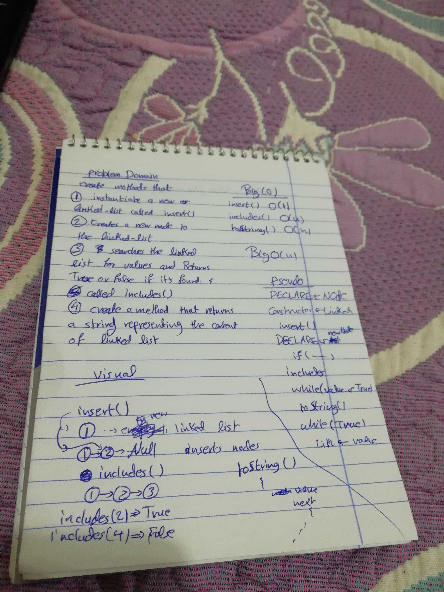

# data-structures-and-algorithms

# Author: 
Ahmad K. Al-Mahasneh 

### Links and Resources

- [submission PR](# data-structures-and-algorithms

# Author: 
Ahmad K. Al-Mahasneh 

### Links and Resources

- [submission PR](https://github.com/ahmadkhaleel96/data-structures-and-algorithms/pull/21)

### Setup
npm i eslint jest

#### How to initialize/run your application (where applicable)

- e.g. `npm run start`

#### Tests
jest --verbose --coverage

- How do you run tests?
    `npm test`

- Any tests of note?
    jest --verbose --coverage

#### UML 

#### worked as a group:
Ahmad K. Al-Mahasneh
Ayman J. Al-Khawaldeh 
Mohammad S Al-Hawamdeh
Qusay A. Al-hanaqtah )

### Setup
npm i eslint jest

#### How to initialize/run your application (where applicable)

- e.g. `npm run start`

#### Tests
jest --verbose --coverage

- How do you run tests?
    `npm test`

- Any tests of note?
    jest --verbose --coverage

#### UML 

#### worked as a group:
Ahmad K. Al-Mahasneh
Ayman J. Al-Khawaldeh 
Mohammad S Al-Hawamdeh
Qusay A. Al-hanaqtah 